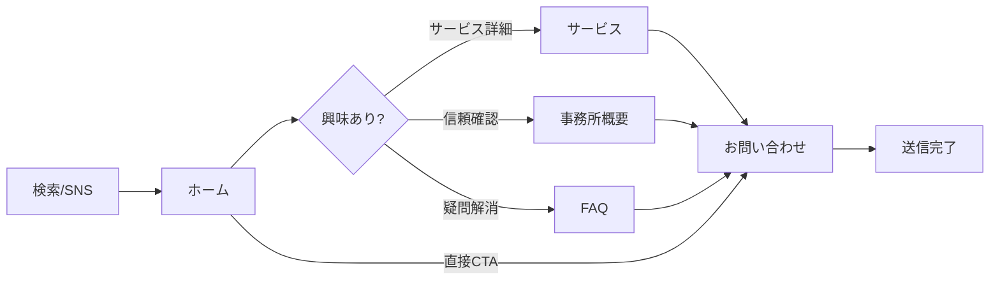
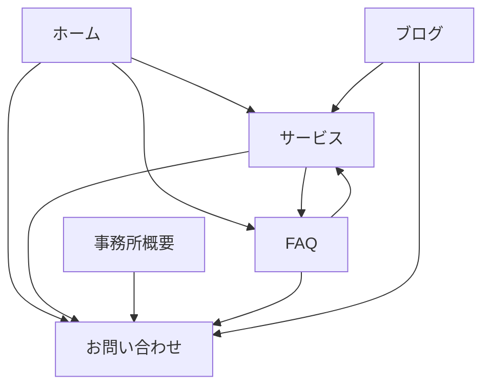

# みやび社会保険労務士事務所 ウェブサイト設計書

> **ドキュメント体系**
> - 要求定義書: 何を実現するか
> - **設計書**（本書）: どのように実現するか
> - 仕様書: 具体的な実装内容

---

## 1. ページ構造設計

### 1.1 サイトマップ

```
miyabi-sr.com/
├── / (ホーム)
├── /services/ (サービス)
├── /about/ (事務所概要)
├── /contact/ (お問い合わせ)
├── /faq/ (よくある質問)
├── /privacy-policy/ (プライバシーポリシー)
└── /blog/ (ブログ一覧)
    └── /blog/{slug}/ (個別記事)
```

### 1.2 ユーザーフロー



### 1.3 ページ別構成

#### ホームページ
| セクション | 内容 | 目的 | 次アクション |
|------------|------|------|-------------|
| ヒーロー | キャッチコピー、CTA | 第一印象 | 無料相談 or サービス |
| Trust Badges | 資格、無料相談、中小企業専門など | 信頼構築 | スクロール継続 |
| 選ばれる理由 | 3つの特徴 | 差別化 | サービス詳細 |
| サービス紹介 | 3カラムカード（**概要のみ**）※ | サービス認知 | サービスページへ |
| CTA | 無料相談誘導 | コンバージョン | 問い合わせ |

> ※ホームのサービスカードは概要説明（1文）+「詳しく見る」リンクのみ。詳細はサービスページに集約。

#### サービスページ
| セクション | 内容 | 次アクション |
|------------|------|-------------|
| ヘッダー | ページタイトル | - |
| サービス一覧 | 3カラムカード（画像+**詳細説明+箇条書き**） | 問い合わせ |
| CTA | 問い合わせ誘導 | 問い合わせ |

#### 事務所概要ページ
| セクション | 内容 | 次アクション |
|------------|------|-------------|
| 代表挨拶 | テキスト | 信頼→問い合わせ |
| 事務所情報 | テーブル形式 | - |
| 対応エリア | 香川県全域 | 問い合わせ |
| CTA | 問い合わせ誘導 | 問い合わせ |

#### お問い合わせページ
| セクション | 内容 | 次アクション |
|------------|------|-------------|
| Trust Badges | オンライン対応、返信期限など | フォーム入力 |
| ご相談の流れ | 4ステップ | フォーム入力 |
| フォーム | Contact Form 7 | 送信 |
| 連絡先カード | 電話、メール、住所 | 電話/メール |

#### FAQページ
| セクション | 内容 | 次アクション |
|------------|------|-------------|
| カテゴリ別FAQ | 5カテゴリ×3問 | 疑問解消→問い合わせ |
| CTA | 問い合わせ誘導 | 問い合わせ |

---

## 2. UI/UX設計

### 2.1 レイアウト

| ページ | レイアウト | サイドバー |
|--------|------------|:----------:|
| 全ページ | 1カラム | なし |
| ブログ一覧 | 1カラム | なし |
| ブログ記事 | 1カラム | なし |

### 2.2 メニュー構成

#### ヘッダーメニュー
| 順序 | ラベル | リンク先 |
|:----:|--------|----------|
| 1 | ホーム | / |
| 2 | サービス | /services/ |
| 3 | 事務所概要 | /about/ |
| 4 | FAQ | /faq/ |
| 5 | お問い合わせ | /contact/ |

#### フッターメニュー
| カラム1 | カラム2 | カラム3 |
|---------|---------|---------|
| サービス | 事務所概要 | お問い合わせ |
| - 手続き代行 | - 代表挨拶 | - フォーム |
| - 給与計算 | - 対応エリア | - 電話 |
| - 労務支援 | FAQ | プライバシーポリシー |

### 2.3 コンポーネント設計

#### ボタン
| タイプ | 背景色 | テキスト色 | 用途 |
|--------|--------|------------|------|
| Primary | #c9a227 | #ffffff | メインCTA |
| Secondary | #5a7a54 | #ffffff | サブCTA |
| Outline | transparent | #ffffff | ヒーロー内 |

#### カード
| 用途 | 背景 | 角丸 | 影 |
|------|------|------|-----|
| サービスカード | #ffffff | 16px | soft |
| FAQアイテム | #ffffff | 16px | soft |
| Trust Badge | #faf9f7 | 50% | none |

#### セクション
| 用途 | 背景 | パディング |
|------|------|------------|
| 標準 | #faf9f7 | 5rem 2rem |
| CTA | #5a7a54 | 4rem 2rem |
| ヒーロー | 画像+overlay | 4rem 2rem |

### 2.4 インタラクション設計

| 要素 | トリガー | 効果 | duration |
|------|----------|------|:--------:|
| ボタン | hover | 背景色明るく、shadow増加 | 0.3s |
| カード | hover | translateY(-8px)、shadow増加 | 0.3s |
| ナビリンク | hover | 下線表示、色変更 | 0.3s |
| CTA | hover | scale(1.02) | 0.3s |
| ページ遷移 | click | scrollTo top smooth | - |

> ⚠️ **注意**: インタラクション（hover, transition）はブロックエディタで設定不可のため、**追加CSS（enhanced-theme.css）で管理**する。詳細は仕様書 §10「スタイル管理ポリシー」を参照。

### 2.5 レスポンシブ設計

| ブレークポイント | カラム数 | 変化 |
|------------------|:--------:|------|
| > 992px | 3 | デスクトップ表示 |
| 768-992px | 1-2 | タブレット |
| < 768px | 1 | モバイル、ハンバーガーメニュー |

---

## 3. 画像設計

### 3.1 画像命名規則

| 種類 | 命名パターン | 例 |
|------|--------------|-----|
| サービス画像 | service-{name}.png | service-insurance.png |
| ヒーロー | hero-{page}.png | hero-home.png |
| OGP | ogp-{page}.jpg | ogp-home.jpg |
| アイコン | icon-{name}.svg | icon-check.svg |

### 3.2 サービスカード画像（3枚）

> 詳細仕様は別紙「サービスカード画像仕様書 v3」を参照

#### 共通仕様
| 項目 | 設定値 |
|------|--------|
| アスペクト比 | 16:9 |
| 色調 | 暖色系 |
| 画風 | フォトリアリスティック |
| 男性キャラ | 35歳前後、白シャツ、袖まくり、顔写らない |

#### 画像一覧
| ファイル名 | 内容 | 場所 |
|------------|------|------|
| service-insurance.png | 手続き作業（PC+書類） | オフィス |
| service-payroll.png | 給与計算（PC+電卓） | オフィス |
| service-consulting.png | 相談シーン（2人） | カフェ |

### 3.3 その他画像

| ファイル名 | サイズ | 形式 | 用途 |
|------------|--------|------|------|
| hero-home.png | 1920×1080 | PNG/WebP | トップページ |
| ogp-home.jpg | 1200×630 | JPG | SNS共有 |
| favicon.png | 512×512 | PNG | ブラウザタブ |
| logo.svg | - | SVG | ヘッダー |

---

## 4. SEO/LLMO設計

### 4.1 構造化データ戦略

| ページ | Schema | 目的 |
|--------|--------|------|
| ホーム | ProfessionalService | ビジネス情報 |
| サービス | Service | サービス詳細 |
| 事務所概要 | LocalBusiness | 所在地情報 |
| お問い合わせ | ContactPage | 連絡先情報 |
| FAQ | FAQPage | LLMO対策 |

### 4.2 メタ情報設計

| ページ | title形式 |
|--------|-----------|
| ホーム | みやび社会保険労務士事務所｜香川県坂出市の社労士 |
| 下層 | {ページ名}｜みやび社会保険労務士事務所 |
| ブログ | {記事タイトル}｜みやび社労士ブログ |

### 4.3 内部リンク設計



---

## 5. WordPress設計

### 5.1 Lightning G3テーマ設定

| 設定項目 | 設定値 |
|----------|--------|
| レイアウト | 1カラム（サイドバーなし） |
| ヘッダー | デフォルト |
| フッター | 3カラム |
| キーカラー | #1a365d |

### 5.2 ブロック設計

| ブロック | 用途 | スタイル |
|----------|------|----------|
| core/cover | ヒーロー | overlay #1a365d 90% |
| core/group | セクション | 背景色、padding |
| core/columns | カード並び | 3カラム |
| core/button | CTA | border-radius: 50px |
| core/heading | 見出し | Noto Serif JP |

### 5.3 プラグイン連携

| プラグイン | 設定内容 |
|------------|----------|
| Contact Form 7 | フォームID取得、ショートコード埋め込み |
| Rank Math | 各ページのSEO設定、FAQブロック |
| Site Kit | GA4プロパティ連携 |

### 5.4 ウィジェット設定

| エリア | ウィジェット |
|--------|-------------|
| フッター1 | サービスメニュー |
| フッター2 | 情報メニュー |
| フッター3 | お問い合わせ情報 |

---

## 6. パフォーマンス設計

### 6.1 Core Web Vitals目標

| 指標 | 目標値 | 対策 |
|------|--------|------|
| LCP (Largest Contentful Paint) | < 2.5s | ヒーロー画像WebP化、遅延読み込み |
| FID (First Input Delay) | < 100ms | JS最小化 |
| CLS (Cumulative Layout Shift) | < 0.1 | 画像サイズ指定、フォントプリロード |

### 6.2 画像最適化

| 画像種別 | 形式 | 最大サイズ | 対策 |
|----------|------|----------|------|
| ヒーロー背景 | WebP | 200KB | 圧縮率調整 |
| サービスカード | WebP | 100KB | リサイズ |
| OGP | JPG | 150KB | 圧縮 |

### 6.3 キャッシュ戦略

| リソース | キャッシュ期間 |
|----------|------------|
| 静的アセット（CSS/JS/画像） | 1年 |
| HTML | なし（毎回取得） |

---

## 7. アクセシビリティ設計

### 7.1 基本方針

| 項目 | 対応 |
|------|------|
| WCAGレベル | 2.1 AA準拠 |
| コントラスト比 | 4.5:1以上（文字）|
| フォーカス表示 | キーボード操作対応 |
| スクリーンリーダー | 適切な見出し階層 |

### 7.2 画像alt属性

| 画像 | altテキスト |
|------|----------|
| ヒーロー背景 | 装飾的のため空（alt=""） |
| サービス画像1 | 社会保険手続きのイメージ |
| サービス画像2 | 給与計算作業のイメージ |
| サービス画像3 | 労務相談のイメージ |
| ロゴ | みやび社会保険労務士事務所 |

### 7.3 フォームアクセシビリティ

| 要素 | 対応 |
|------|------|
| label | 全入力項目にlabel紐付け |
| 必須表示 | 「*必須」明記 |
| エラー表示 | 赤文字+アイコン |

---

## 8. エラー画面設計

### 8.1 404ページ

| 要素 | 内容 |
|------|------|
| メッセージ | お探しのページは見つかりませんでした |
| 説明 | URLが変更されたか、ページが削除された可能性があります |
| CTA | ホームへ戻るボタン |
| デザイン | メインカラー、シンプル |

---

## 9. 実装フロー

### 9.1 WordPress構築手順

| # | ステップ | 所要時間 |
|:-:|----------|:--------:|
| 1 | WordPress インストール | 10分 |
| 2 | Lightning G3 テーマ有効化 | 5分 |
| 3 | プラグイン インストール・有効化 | 15分 |
| 4 | pages.xml インポート | 10分 |
| 5 | Lightning カスタマイザー設定 | 20分 |
| 6 | メニュー設定 | 15分 |
| 7 | Contact Form 7 設定 | 20分 |
| 8 | Rank Math SEO設定 | 30分 |
| 9 | GA4 連携 | 15分 |
| 10 | 画像アップロード・差し替え | 30分 |
| 11 | 最終確認 | 30分 |
| | **合計** | **約3時間** |

### 9.2 チェックリスト

#### 表示確認
- [ ] 全ページ表示確認
- [ ] モバイル表示確認
- [ ] タブレット表示確認
- [ ] 各ブラウザ確認（Chrome, Safari, Edge）

#### 機能確認
- [ ] フォーム送信テスト
- [ ] Slack通知確認
- [ ] 内部リンク確認
- [ ] 外部リンク確認

#### SEO確認
- [ ] メタ情報確認
- [ ] OGP確認
- [ ] 構造化データ確認（Rich Results Test）
- [ ] ページ速度確認（PageSpeed Insights）

---

## 改訂履歴

| 日付 | バージョン | 内容 |
|------|:----------:|------|
| 2024/12/12 | 1.0 | 初版作成 |
| 2024/12/12 | 1.1 | ユーザーフロー、メニュー構成、インタラクション設計追加 |
| 2024/12/12 | 1.2 | パフォーマンス、アクセシビリティ、エラー画面設計追加 |
| 2024/12/12 | 1.3 | 小見出し番号修正、最終ブラッシュアップ |
| 2024/12/13 | **1.4** | **ホーム/サービスページの役割分担を明確化** |
